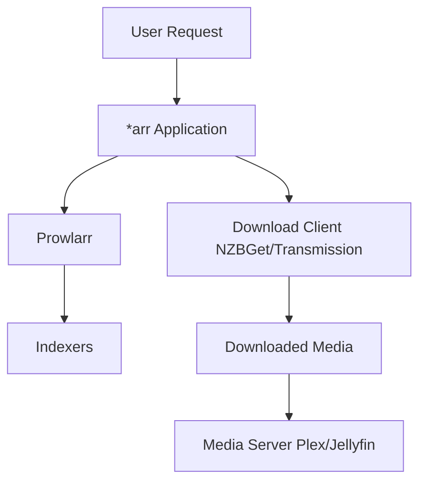

# Media Management (\*arr Stack) Skill

## Overview

The **\*arr stack** (Radarr, Sonarr, Lidarr, Prowlarr, and related applications) is a comprehensive suite of media
automation tools for managing, downloading, and organizing movies, TV shows, music, and other media content. These
applications work together to provide automated media acquisition, organization, and integration with media servers like
Plex and Jellyfin.

### Key Applications

- **Radarr**: Movie collection manager and downloader
- **Sonarr**: TV series collection manager and downloader
- **Lidarr**: Music collection manager and downloader
- **Prowlarr**: Indexer manager that integrates with all \*arr applications
- **Jackett**: Legacy indexer proxy (being replaced by Prowlarr)

### Key Features

- **Automated media acquisition**: Monitor releases and automatically download when available
- **Quality management**: Define quality profiles and upgrade media automatically
- **Metadata management**: Fetch and organize metadata, artwork, and subtitles
- **Indexer integration**: Connect to multiple indexers through Prowlarr
- **Download client support**: Integrate with NZBGet, Transmission, qBittorrent, and more
- **Media server integration**: Direct integration with Plex, Jellyfin, and Emby
- **Calendar tracking**: Track release schedules and upcoming content
- **Rename and organize**: Automatically rename and organize files with customizable patterns
- **API access**: Full REST API for automation and custom integrations

### Why Use the \*arr Stack?

**Problem**: Managing a media library manually is time-consuming and error-prone:

- Manually searching for new releases across multiple sites
- Inconsistent file naming and organization
- Missing metadata and artwork
- No automated quality upgrades
- Complex integration between download clients and media servers
- Difficult to track what's been downloaded vs. what's wanted

**Solution**: The \*arr stack provides a unified, automated solution that:

- Monitors multiple indexers automatically through Prowlarr
- Downloads content based on your quality preferences
- Organizes and renames files consistently
- Integrates seamlessly with media servers
- Upgrades content when better quality becomes available
- Provides a modern web interface for management

### How It Works



1. **Add Content**: Add movies (Radarr), TV shows (Sonarr), or music (Lidarr) to your library
2. **Search Indexers**: Prowlarr queries configured indexers for available releases
3. **Quality Matching**: \*arr apps filter results based on quality profiles and preferences
4. **Download**: Send best match to download client (NZBGet, Transmission, etc.)
5. **Post-Processing**: Rename, organize, and move completed downloads
6. **Metadata**: Fetch and organize metadata, artwork, and subtitles
7. **Media Server**: Notify media server (Plex, Jellyfin) of new content
8. **Monitoring**: Continue monitoring for quality upgrades

### Project Information

- **Servarr Organization**: <https://servarr.com>
- **Servarr Wiki**: <https://wiki.servarr.com>
- **License**: GPL-3.0
- **Platforms**: Windows, Linux, macOS, Docker
- **NixOS**: Native service modules available
- **Maturity**: Production-ready, widely used in home media setups

## Installation on NixOS

### NixOS with Flakes (Recommended)

The standard NixOS packages include native service modules for all \*arr applications:

```nix
# configuration.nix or flake module
{ config, pkgs, ... }:
{
  services = {
    # Indexer manager (core component)
    prowlarr = {
      enable = true;
      openFirewall = true;  # Opens port 9696
    };

    # Movie manager
    radarr = {
      enable = true;
      openFirewall = true;  # Opens port 7878
    };

    # TV series manager
    sonarr = {
      enable = true;
      openFirewall = true;  # Opens port 8989
    };

    # Music manager
    lidarr = {
      enable = true;
      openFirewall = true;  # Opens port 8686
    };

    # Legacy indexer proxy (optional)
    jackett = {
      enable = true;
      openFirewall = true;  # Opens port 9117
    };
  };
}
```

### Using Unstable Packages

For the latest versions:

```nix
{ config, pkgs, pkgs-unstable, ... }:
{
  services = {
    prowlarr = {
      enable = true;
      package = pkgs-unstable.prowlarr;
    };

    radarr = {
      enable = true;
      package = pkgs-unstable.radarr;
    };

    sonarr = {
      enable = true;
      package = pkgs-unstable.sonarr;
    };

    lidarr = {
      enable = true;
      package = pkgs-unstable.lidarr;
    };
  };
}
```

### Alternative: Nixarr Module

The **Nixarr** module provides a comprehensive media server stack with built-in VPN support:

Add to your `flake.nix`:

```nix
{
  inputs = {
    nixpkgs.url = "github:NixOS/nixpkgs/nixos-unstable";
    nixarr.url = "github:rasmus-kirk/nixarr";
  };

  outputs = { nixpkgs, nixarr, ... }: {
    nixosConfigurations.mediaserver = nixpkgs.lib.nixosSystem {
      modules = [
        nixarr.nixosModules.default
        ./configuration.nix
      ];
    };
  };
}
```

Use in configuration:

```nix
{ config, ... }:
{
  nixarr = {
    enable = true;

    # VPN support
    vpn = {
      enable = true;
      wgConf = "/path/to/wireguard.conf";
    };

    # Media apps
    radarr.enable = true;
    sonarr.enable = true;
    lidarr.enable = true;
    prowlarr.enable = true;

    # Media servers
    jellyfin.enable = true;
    plex.enable = true;

    # Download clients
    transmission.enable = true;
  };
}
```

## NixOS Service Configuration Reference

### Common Options (All \*arr Services)

All \*arr applications share these common NixOS service options:

#### enable

**Type**: `boolean`
**Default**: `false`

Enable the service.

```nix
services.radarr.enable = true;
```

#### package

**Type**: `package`
**Default**: Service-specific package from nixpkgs

Package to use for the service.

```nix
services.radarr.package = pkgs-unstable.radarr;
```

#### dataDir

**Type**: `string`
**Default**: `/var/lib/<service>`

Directory where the service stores its data.

```nix
services.radarr.dataDir = "/mnt/media/radarr";
```

**Important**: Ensure the directory exists and has correct permissions:

```nix
systemd.tmpfiles.rules = [
  "d /mnt/media/radarr 0755 <user> <group> -"
];
```

#### openFirewall

**Type**: `boolean`
**Default**: `false`

Automatically open the firewall port for the service.

```nix
services.prowlarr.openFirewall = true;
```

Alternatively, manually configure firewall:

```nix
networking.firewall.allowedTCPPorts = [
  7878  # Radarr
  8989  # Sonarr
  8686  # Lidarr
  9696  # Prowlarr
];
```

#### user

**Type**: `string`
**Default**: Service-specific user

User account under which the service runs.

```nix
services.radarr.user = "media";
```

#### group

**Type**: `string`
**Default**: Service-specific group

Group under which the service runs.

```nix
services.radarr.group = "media";
```

### Service-Specific Ports

Default ports for each service:

- **Radarr**: 7878
- **Sonarr**: 8989
- **Lidarr**: 8686
- **Prowlarr**: 9696
- **Jackett**: 9117
- **Readarr**: 8787

### Radarr Configuration

```nix
{ config, pkgs, ... }:
{
  services.radarr = {
    enable = true;
    dataDir = "/mnt/media/radarr";
    package = pkgs.radarr;
    user = "media";
    group = "media";
    openFirewall = true;
  };

  # Ensure data directory exists
  systemd.tmpfiles.rules = [
    "d /mnt/media/radarr 0755 media media -"
  ];
}
```

### Sonarr Configuration

```nix
{ config, pkgs, ... }:
{
  services.sonarr = {
    enable = true;
    dataDir = "/mnt/media/sonarr";
    package = pkgs.sonarr;
    user = "media";
    group = "media";
    openFirewall = true;
  };

  systemd.tmpfiles.rules = [
    "d /mnt/media/sonarr 0755 media media -"
  ];
}
```

### Lidarr Configuration

```nix
{ config, pkgs, ... }:
{
  services.lidarr = {
    enable = true;
    dataDir = "/mnt/media/lidarr";
    package = pkgs.lidarr;
    user = "media";
    group = "media";
    openFirewall = true;
  };

  systemd.tmpfiles.rules = [
    "d /mnt/media/lidarr 0755 media media -"
  ];
}
```

### Prowlarr Configuration

```nix
{ config, pkgs, ... }:
{
  services.prowlarr = {
    enable = true;
    dataDir = "/mnt/media/prowlarr";
    package = pkgs.prowlarr;
    openFirewall = true;
  };

  systemd.tmpfiles.rules = [
    "d /mnt/media/prowlarr 0755 prowlarr prowlarr -"
  ];
}
```

## Complete Media Server Configuration Example

Here's a comprehensive configuration for a complete media server:

```nix
{ config, pkgs, pkgs-unstable, ... }:
{
  # Create a shared media user
  users.users.media = {
    isSystemUser = true;
    group = "media";
    extraGroups = [ "transmission" "nzbget" ];
  };

  users.groups.media = {};

  services = {
    # Indexer manager
    prowlarr = {
      enable = true;
      dataDir = "/mnt/media/prowlarr";
      package = pkgs-unstable.prowlarr;
      openFirewall = true;
    };

    # Movie manager
    radarr = {
      enable = true;
      user = "media";
      dataDir = "/mnt/media/radarr";
      package = pkgs-unstable.radarr;
      openFirewall = true;
    };

    # TV series manager
    sonarr = {
      enable = true;
      user = "media";
      dataDir = "/mnt/media/sonarr";
      package = pkgs-unstable.sonarr;
      openFirewall = true;
    };

    # Music manager
    lidarr = {
      enable = true;
      user = "media";
      dataDir = "/mnt/media/lidarr";
      package = pkgs-unstable.lidarr;
      openFirewall = true;
    };

    # Download client - NZBGet (Usenet)
    nzbget = {
      enable = true;
      user = "media";
      package = pkgs-unstable.nzbget;
      settings = {
        MainDir = "/mnt/media/nzbget";
        DestDir = "/mnt/media/Media/Downloads";
        InterDir = "/mnt/media/nzbget/intermediate";
        QueueDir = "/mnt/media/nzbget/queue";
        TempDir = "/mnt/media/nzbget/tmp";
        ControlIP = "0.0.0.0";
        ControlPort = 6789;
      };
    };

    # Download client - Transmission (Torrents)
    transmission = {
      enable = true;
      user = "media";
      home = "/mnt/media/transmission";
      package = pkgs-unstable.transmission_4;
      settings = {
        rpc-bind-address = "0.0.0.0";
        rpc-whitelist = "127.0.0.1,192.168.*.*";
        download-dir = "/mnt/media/Media/Downloads";
        incomplete-dir = "/mnt/media/transmission/incomplete";
        incomplete-dir-enabled = true;
      };
    };

    # Media server - Plex
    plex = {
      enable = true;
      user = "media";
      dataDir = "/mnt/media/plex";
      package = pkgs-unstable.plex;
    };
  };

  # Create all required directories
  systemd.tmpfiles.rules = [
    "d /mnt/media/prowlarr 0755 prowlarr prowlarr -"
    "d /mnt/media/radarr 0755 media media -"
    "d /mnt/media/sonarr 0755 media media -"
    "d /mnt/media/lidarr 0755 media media -"
    "d /mnt/media/nzbget 0755 media media -"
    "d /mnt/media/nzbget/intermediate 0755 media media -"
    "d /mnt/media/nzbget/queue 0755 media media -"
    "d /mnt/media/nzbget/tmp 0755 media media -"
    "d /mnt/media/transmission 0755 media media -"
    "d /mnt/media/transmission/incomplete 0755 media media -"
    "d /mnt/media/Media/Downloads 0755 media media -"
    "d /mnt/media/Media/Movies 0755 media media -"
    "d /mnt/media/Media/TV 0755 media media -"
    "d /mnt/media/Media/Music 0755 media media -"
    "d /mnt/media/plex 0755 media media -"
  ];

  # Firewall configuration
  networking.firewall.allowedTCPPorts = [
    6789   # NZBGet
    7878   # Radarr
    8686   # Lidarr
    8989   # Sonarr
    9091   # Transmission
    9696   # Prowlarr
    32400  # Plex
  ];
}
```

## Initial Setup and Configuration

After deploying the configuration, you need to configure each application through their web interfaces.

### 1. Prowlarr Setup (Do This First!)

Prowlarr is the central indexer manager that feeds all other \*arr applications.

**Access**: `http://your-server:9696`

1. **Complete initial setup wizard**
2. **Add indexers**:
   - Settings → Indexers → Add Indexer
   - Configure your preferred indexers (public or private)
   - Test each indexer connection
3. **Configure \*arr applications**:
   - Settings → Apps → Add Application
   - Add Radarr, Sonarr, and Lidarr
   - Enter their URLs and API keys
   - Prowlarr will automatically sync indexers to all apps

### 2. Radarr Setup (Movies)

**Access**: `http://your-server:7878`

1. **Complete initial setup**
2. **Add root folder**:
   - Settings → Media Management → Root Folders
   - Add `/mnt/media/Media/Movies`
3. **Configure quality profiles**:
   - Settings → Profiles
   - Create profiles for different quality levels (1080p, 4K, etc.)
4. **Add download client**:
   - Settings → Download Clients
   - Add NZBGet or Transmission
   - Configure connection details
5. **Connect Prowlarr** (if not auto-configured):
   - Settings → Indexers
   - Should auto-populate from Prowlarr
6. **Add movies**:
   - Movies → Add New Movie
   - Search and add desired movies

### 3. Sonarr Setup (TV Series)

**Access**: `http://your-server:8989`

1. **Complete initial setup**
2. **Add root folder**:
   - Settings → Media Management → Root Folders
   - Add `/mnt/media/Media/TV`
3. **Configure quality profiles**:
   - Settings → Profiles
   - Set up profiles for different qualities
4. **Add download client**:
   - Settings → Download Clients
   - Add NZBGet or Transmission
5. **Connect Prowlarr** (if not auto-configured):
   - Settings → Indexers
6. **Add TV series**:
   - Series → Add New Series
   - Search and add desired shows

### 4. Lidarr Setup (Music)

**Access**: `http://your-server:8686`

1. **Complete initial setup**
2. **Add root folder**:
   - Settings → Media Management → Root Folders
   - Add `/mnt/media/Media/Music`
3. **Configure quality profiles**:
   - Settings → Profiles
   - Set up profiles for audio quality
4. **Add download client**:
   - Settings → Download Clients
   - Add NZBGet or Transmission
5. **Connect Prowlarr** (if not auto-configured):
   - Settings → Indexers
6. **Add artists/albums**:
   - Artists → Add New Artist
   - Search and add desired artists

### 5. Plex Integration

**Access**: `http://your-server:32400/web`

1. **Complete Plex setup**
2. **Add libraries**:
   - Movies: `/mnt/media/Media/Movies`
   - TV Shows: `/mnt/media/Media/TV`
   - Music: `/mnt/media/Media/Music`
3. **Configure \*arr integrations**:
   - In Radarr/Sonarr/Lidarr: Settings → Connect
   - Add "Plex Media Server"
   - Plex will auto-update when media is added

## Common Use Cases

### Automated Movie Collection

```nix
# NixOS configuration already done above

# Web UI Configuration (Radarr):
# 1. Add root folder: /mnt/media/Media/Movies
# 2. Create quality profile: "HD-1080p"
# 3. Add movie to monitored list
# 4. Radarr automatically:
#    - Searches indexers via Prowlarr
#    - Sends to NZBGet/Transmission
#    - Renames and organizes downloaded file
#    - Notifies Plex
#    - Continues monitoring for upgrades
```

### Automated TV Series Tracking

```nix
# Sonarr automatically:
# 1. Monitors upcoming episode releases
# 2. Downloads new episodes as they air
# 3. Organizes by season/episode
# 4. Renames with consistent naming
# 5. Notifies Plex of new content
# 6. Tracks watched status
```

### Music Library Management

```nix
# Lidarr features:
# 1. Track entire artist discographies
# 2. Automatic album monitoring
# 3. Quality upgrading (MP3 → FLAC)
# 4. Metadata and artwork fetching
# 5. Integration with MusicBrainz
```

### Quality Upgrading

```yaml
# Configure in Settings → Profiles:
# 1. Set quality progression: WEBDL-720p → WEBDL-1080p → BluRay-1080p
# 2. Enable "Upgrade until" quality
# 3. *arr apps automatically replace files when better quality available
# 4. Old files are automatically deleted
```

### Automated Subtitle Downloads

```nix
# In Radarr/Sonarr Settings → Metadata:
services.bazarr = {
  enable = true;  # Subtitle manager
  user = "media";
};

# Bazarr integrates with Radarr/Sonarr to:
# 1. Automatically download subtitles
# 2. Support multiple languages
# 3. Match subtitles to releases
# 4. Sync with Plex
```

### VPN Integration

```nix
# Using Nixarr with VPN:
{
  nixarr.vpn = {
    enable = true;
    wgConf = "/secrets/wireguard.conf";
  };

  # Route download clients through VPN:
  nixarr.transmission.vpn.enable = true;
  nixarr.nzbget.vpn.enable = true;
}

# Manual VPN configuration:
{
  services.transmission.settings = {
    bind-address-ipv4 = "10.0.0.2";  # VPN interface IP
  };
}
```

## Advanced Configuration

### Database Backend (PostgreSQL)

For better performance with large libraries:

```nix
{ config, pkgs, ... }:
{
  services.postgresql = {
    enable = true;
    ensureDatabases = [ "radarr" "sonarr" "lidarr" "prowlarr" ];
    ensureUsers = [
      {
        name = "radarr";
        ensureDBOwnership = true;
      }
      {
        name = "sonarr";
        ensureDBOwnership = true;
      }
      {
        name = "lidarr";
        ensureDBOwnership = true;
      }
      {
        name = "prowlarr";
        ensureDBOwnership = true;
      }
    ];
  };

  # Configure in each app's web UI:
  # Settings → General → Database
  # Type: PostgreSQL
  # Host: localhost
  # Database: radarr (or sonarr/lidarr/prowlarr)
  # User: radarr (or sonarr/lidarr/prowlarr)
}
```

### Reverse Proxy (Nginx)

Expose services through HTTPS:

```nix
{ config, ... }:
{
  services.nginx = {
    enable = true;
    virtualHosts = {
      "radarr.example.com" = {
        enableACME = true;
        forceSSL = true;
        locations."/" = {
          proxyPass = "http://127.0.0.1:7878";
          proxyWebsockets = true;
        };
      };

      "sonarr.example.com" = {
        enableACME = true;
        forceSSL = true;
        locations."/" = {
          proxyPass = "http://127.0.0.1:8989";
          proxyWebsockets = true;
        };
      };

      "prowlarr.example.com" = {
        enableACME = true;
        forceSSL = true;
        locations."/" = {
          proxyPass = "http://127.0.0.1:9696";
          proxyWebsockets = true;
        };
      };
    };
  };

  security.acme.acceptTerms = true;
  security.acme.defaults.email = "admin@example.com";
}
```

### Authentication (Authelia)

Add SSO authentication:

```nix
{ config, ... }:
{
  services.authelia.instances.main = {
    enable = true;
    settings = {
      theme = "dark";
      default_2fa_method = "totp";
    };
  };

  # Configure Nginx to use Authelia
  services.nginx.virtualHosts."radarr.example.com" = {
    locations."/".extraConfig = ''
      auth_request /authelia;
      auth_request_set $user $upstream_http_remote_user;
      auth_request_set $groups $upstream_http_remote_groups;
    '';

    locations."/authelia" = {
      proxyPass = "http://127.0.0.1:9091/api/verify";
    };
  };
}
```

### Custom Scripts and Notifications

```nix
{ config, pkgs, ... }:
{
  # Custom post-processing script
  environment.systemPackages = [
    (pkgs.writeScriptBin "media-postprocess" ''
      #!${pkgs.bash}/bin/bash
      # Custom post-processing logic
      echo "Processing: $1"
      # Notify external services
      ${pkgs.curl}/bin/curl -X POST http://notification-service/webhook
    '')
  ];

  # Configure in Radarr/Sonarr:
  # Settings → Connect → Custom Script
  # Path: /run/current-system/sw/bin/media-postprocess
}
```

### Recyclarr (Quality Profile Sync)

Automatically sync TRaSH Guides quality profiles:

```nix
{ config, pkgs, ... }:
{
  services.recyclarr = {
    enable = true;
    settings = {
      radarr = {
        default = {
          base_url = "http://localhost:7878";
          api_key = "!env_var RADARR_API_KEY";
          delete_old_custom_formats = true;
          quality_definition = {
            type = "movie";
          };
        };
      };
      sonarr = {
        default = {
          base_url = "http://localhost:8989";
          api_key = "!env_var SONARR_API_KEY";
          quality_definition = {
            type = "series";
          };
        };
      };
    };
  };
}
```

## Best Practices

### 1. Directory Structure

```text
/mnt/media/
├── Downloads/          # Completed downloads
├── Movies/            # Radarr root folder
├── TV/                # Sonarr root folder
├── Music/             # Lidarr root folder
├── radarr/            # Radarr data
├── sonarr/            # Sonarr data
├── lidarr/            # Lidarr data
├── prowlarr/          # Prowlarr data
├── nzbget/            # NZBGet data
├── transmission/      # Transmission data
└── plex/              # Plex data
```

### 2. Permissions

```nix
# Use a shared media user/group
users.users.media = {
  isSystemUser = true;
  group = "media";
  uid = 1000;  # Consistent UID across systems
};

users.groups.media.gid = 1000;

# All services use the same user
services.radarr.user = "media";
services.sonarr.user = "media";
services.lidarr.user = "media";
services.transmission.user = "media";
services.nzbget.user = "media";
services.plex.user = "media";

# Correct directory permissions
systemd.tmpfiles.rules = [
  "d /mnt/media 0755 media media -"
  "d /mnt/media/Downloads 0775 media media -"
  "d /mnt/media/Movies 0775 media media -"
  "d /mnt/media/TV 0775 media media -"
  "d /mnt/media/Music 0775 media media -"
];
```

### 3. Naming Conventions

Configure consistent file naming in each app:

**Radarr** - Settings → Media Management → File Management:

```text
Movie Format: {Movie Title} ({Release Year}) - {Quality Full}
Movie Folder: {Movie Title} ({Release Year})
```

**Sonarr** - Settings → Media Management → Episode Naming:

```text
Standard Episode Format: {Series Title} - S{season:00}E{episode:00} - {Episode Title} [{Quality Full}]
Season Folder Format: Season {season:00}
```

**Lidarr** - Settings → Media Management → File Management:

```text
Album Format: {Album Title} ({Release Year})
Track Format: {track:00} - {Track Title}
```

### 4. Quality Profiles

Create realistic quality profiles:

```yaml
# Example HD Quality Profile:
- Minimum: WEBDL-720p
- Preferred: WEBDL-1080p, BluRay-1080p
- Maximum: BluRay-1080p
- Upgrade Until: BluRay-1080p

# Example 4K Quality Profile:
- Minimum: WEBDL-2160p
- Preferred: BluRay-2160p
- Maximum: BluRay-2160p
- Upgrade Until: BluRay-2160p
```

### 5. Backup Configuration

```nix
{ config, pkgs, ... }:
{
  # Backup *arr configurations
  services.restic.backups.media-config = {
    paths = [
      "/mnt/media/radarr"
      "/mnt/media/sonarr"
      "/mnt/media/lidarr"
      "/mnt/media/prowlarr"
    ];
    repository = "/backups/media-config";
    passwordFile = config.age.secrets.restic-password.path;
    timerConfig = {
      OnCalendar = "daily";
    };
    pruneOpts = [
      "--keep-daily 7"
      "--keep-weekly 4"
      "--keep-monthly 12"
    ];
  };
}
```

### 6. Monitoring

```nix
{ config, ... }:
{
  # Monitor service health
  services.prometheus.exporters.systemd = {
    enable = true;
    extraFlags = [
      "--systemd.collector.unit-include=(radarr|sonarr|lidarr|prowlarr|nzbget|transmission).service"
    ];
  };

  # Custom exporter for *arr statistics
  systemd.services.arr-exporter = {
    description = "*arr Statistics Exporter";
    wantedBy = [ "multi-user.target" ];
    script = ''
      # Export metrics from *arr APIs
      ${pkgs.python3}/bin/python3 /path/to/arr-exporter.py
    '';
  };
}
```

### 7. Resource Management

```nix
{ config, ... }:
{
  # Limit resource usage
  systemd.services.radarr.serviceConfig = {
    MemoryMax = "512M";
    CPUQuota = "50%";
  };

  systemd.services.sonarr.serviceConfig = {
    MemoryMax = "512M";
    CPUQuota = "50%";
  };

  systemd.services.transmission.serviceConfig = {
    MemoryMax = "1G";
    CPUQuota = "80%";
    Nice = 10;  # Lower priority
  };
}
```

### 8. Security Hardening

```nix
{ config, ... }:
{
  # Harden services with systemd
  systemd.services.radarr.serviceConfig = {
    ProtectSystem = "strict";
    ProtectHome = true;
    PrivateTmp = true;
    NoNewPrivileges = true;
    ReadWritePaths = [
      "/mnt/media/radarr"
      "/mnt/media/Movies"
      "/mnt/media/Downloads"
    ];
  };

  # Enable authentication
  # Configure in each app's web UI:
  # Settings → General → Security
  # - Enable authentication
  # - Set username/password
  # - Enable API key
}
```

### 9. Update Management

```nix
{ config, pkgs-unstable, ... }:
{
  # Use unstable for latest versions
  services.radarr.package = pkgs-unstable.radarr;
  services.sonarr.package = pkgs-unstable.sonarr;
  services.lidarr.package = pkgs-unstable.lidarr;
  services.prowlarr.package = pkgs-unstable.prowlarr;

  # Automated flake updates
  systemd.services.flake-update = {
    description = "Update Nix Flakes";
    serviceConfig = {
      Type = "oneshot";
      ExecStart = "${pkgs.nix}/bin/nix flake update";
      WorkingDirectory = "/etc/nixos";
    };
  };

  systemd.timers.flake-update = {
    wantedBy = [ "timers.target" ];
    timerConfig = {
      OnCalendar = "weekly";
      Persistent = true;
    };
  };
}
```

## Troubleshooting

### Services Won't Start

**Check service status:**

```bash
systemctl status radarr sonarr lidarr prowlarr
journalctl -u radarr -f
```

**Check permissions:**

```bash
ls -la /mnt/media/radarr
# Should be owned by the service user
sudo chown -R media:media /mnt/media/radarr
```

**Check port conflicts:**

```bash
ss -tlnp | grep -E "(7878|8989|8686|9696)"
```

### Cannot Connect to Download Client

**Verify download client is running:**

```bash
systemctl status nzbget transmission
```

**Check network connectivity:**

```bash
curl http://localhost:6789  # NZBGet
curl http://localhost:9091  # Transmission
```

**Verify configuration:**

- In Radarr/Sonarr/Lidarr: Settings → Download Clients
- Test connection
- Check host, port, username, password

### Indexers Not Working

**Check Prowlarr:**

```bash
systemctl status prowlarr
journalctl -u prowlarr -f
```

**Test indexers in Prowlarr:**

- Prowlarr → Indexers → Test All
- Check for rate limiting
- Verify indexer credentials

**Sync to \*arr apps:**

- Prowlarr → Apps → Sync
- Check API keys match

### Downloads Not Importing

**Check download client category:**

- Download client must use correct category
- Radarr: "radarr"
- Sonarr: "sonarr"
- Lidarr: "lidarr"

**Check permissions:**

```bash
# Download client must be able to read downloads
ls -la /mnt/media/Downloads
# *arr apps must be able to move/rename files
sudo chown -R media:media /mnt/media/Downloads
```

**Check paths:**

- Download client and \*arr apps must see the same paths
- Use bind mounts if using containers
- Verify "Remote Path Mappings" in Settings → Download Clients

### Database Corruption

**Backup and restore:**

```bash
# Stop service
sudo systemctl stop radarr

# Backup database
cp /mnt/media/radarr/radarr.db /tmp/radarr.db.backup

# Restore from backup
cp /tmp/radarr.db.backup /mnt/media/radarr/radarr.db

# Restart service
sudo systemctl start radarr
```

**Reset database (last resort):**

```bash
sudo systemctl stop radarr
sudo rm /mnt/media/radarr/radarr.db*
sudo systemctl start radarr
# Reconfigure from scratch
```

### High Resource Usage

**Check SQLite database size:**

```bash
du -sh /mnt/media/*/radarr.db
```

**Migrate to PostgreSQL** (see Advanced Configuration)

**Limit indexer queries:**

- Settings → Indexers → Limit indexer query
- Reduce RSS sync interval

**Clean up history:**

- Settings → General → Housekeeping
- Enable automatic cleanup

### API Key Issues

**Regenerate API key:**

- Settings → General → Security → API Key
- Regenerate
- Update in Prowlarr and other integrations

**Check CORS settings:**

- Settings → General → Security
- Enable CORS if using external tools

## Security Considerations

### Authentication

**Enable built-in authentication:**

```text
Settings → General → Security
- Authentication: Forms (Basic) or Forms (Login Page)
- Username: admin
- Password: strong-password
```

**Use reverse proxy authentication** (recommended for external access):

```nix
services.nginx.virtualHosts."radarr.example.com" = {
  basicAuth = { "admin" = "hashed-password"; };
};
```

### API Keys

**Protect API keys:**

- Never commit API keys to version control
- Use secrets management (agenix):

```nix
{ config, ... }:
{
  age.secrets.radarr-api-key = {
    file = ./secrets/radarr-api-key.age;
    owner = "radarr";
    mode = "0400";
  };

  # Configure API key in web UI from secret file
}
```

### Network Security

**Firewall rules:**

```nix
networking.firewall = {
  enable = true;
  allowedTCPPorts = [
    7878 8989 8686 9696  # Only if needed externally
  ];

  # Better: use reverse proxy and only open HTTPS
  allowedTCPPorts = [ 443 ];
};
```

**VPN for downloads:**

```nix
# Route download traffic through VPN
services.transmission.settings = {
  bind-address-ipv4 = "10.0.0.2";  # VPN interface
};
```

### Update Security

**Monitor for updates:**

- Subscribe to Servarr security advisories
- Keep NixOS packages updated
- Use automated update checks

**Test updates:**

```bash
# Test in VM or staging environment first
nixos-rebuild test --flake .#mediaserver
```

## Integration with Other Services

### Jellyfin

```nix
{ config, ... }:
{
  services.jellyfin = {
    enable = true;
    user = "media";
  };

  # Configure in Radarr/Sonarr/Lidarr:
  # Settings → Connect → Add → Jellyfin
}
```

### Overseerr (Request Management)

```nix
{ config, pkgs, ... }:
{
  virtualisation.oci-containers.containers.overseerr = {
    image = "sctx/overseerr:latest";
    ports = [ "5055:5055" ];
    volumes = [
      "/mnt/media/overseerr:/app/config"
    ];
  };

  networking.firewall.allowedTCPPorts = [ 5055 ];
}
```

### Tautulli (Plex Monitoring)

```nix
{ config, pkgs, ... }:
{
  services.tautulli = {
    enable = true;
    user = "media";
    dataDir = "/mnt/media/tautulli";
    port = 8181;
  };
}
```

### Ombi (Alternative Request System)

```nix
{ config, ... }:
{
  services.ombi = {
    enable = true;
    user = "media";
  };
}
```

## Resources

### Official Documentation

- **Servarr Wiki**: <https://wiki.servarr.com>
- **Radarr**: <https://radarr.video>
- **Sonarr**: <https://sonarr.tv>
- **Lidarr**: <https://lidarr.audio>
- **Prowlarr**: <https://prowlarr.com>

### NixOS Resources

- **NixOS Wiki - Radarr**: <https://wiki.nixos.org/wiki/Radarr>
- **NixOS Wiki - Prowlarr**: <https://wiki.nixos.org/wiki/Prowlarr>
- **Nixarr Project**: <https://nixarr.com>
- **NixOS Options**: <https://search.nixos.org>

### Community

- **Servarr Discord**: Official support community
- **r/radarr, r/sonarr**: Reddit communities
- **NixOS Discourse**: NixOS-specific help

### Related Tools

- **TRaSH Guides**: <https://trash-guides.info> - Quality profiles and guides
- **Recyclarr**: Automated quality profile sync
- **Bazarr**: Subtitle management
- **Tdarr**: Transcoding and library optimization

## Quick Reference

### Service URLs

```text
Radarr:    http://server:7878
Sonarr:    http://server:8989
Lidarr:    http://server:8686
Prowlarr:  http://server:9696
Jackett:   http://server:9117
NZBGet:    http://server:6789
Transmission: http://server:9091
Plex:      http://server:32400/web
```

### Common Commands

```bash
# Check service status
systemctl status radarr sonarr lidarr prowlarr

# View logs
journalctl -u radarr -f
journalctl -u sonarr --since "1 hour ago"

# Restart services
sudo systemctl restart radarr sonarr lidarr prowlarr

# Check configuration
nixos-rebuild test --flake .#mediaserver
```

### Directory Structure

```text
/mnt/media/
├── radarr/          # Radarr config
├── sonarr/          # Sonarr config
├── lidarr/          # Lidarr config
├── prowlarr/        # Prowlarr config
├── Downloads/       # Completed downloads
├── Movies/          # Organized movies
├── TV/              # Organized TV shows
└── Music/           # Organized music
```

This comprehensive skill covers everything you need to set up and manage a complete media automation system with the \*arr
stack on NixOS!
