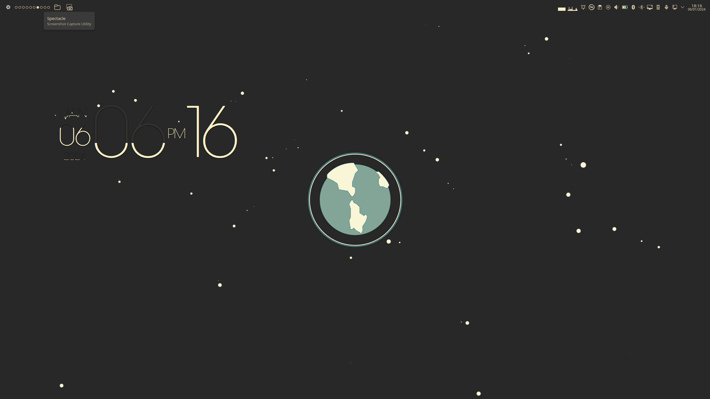
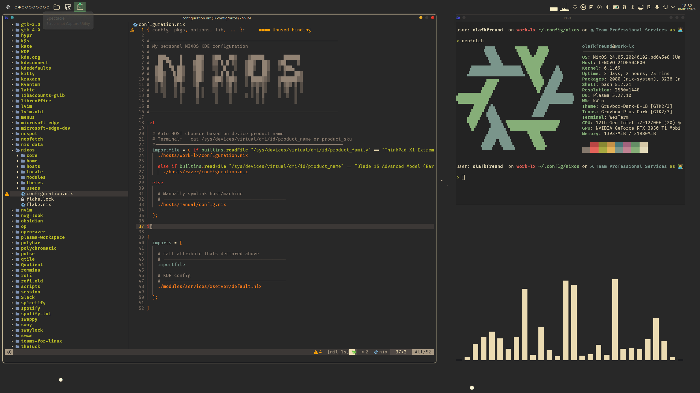
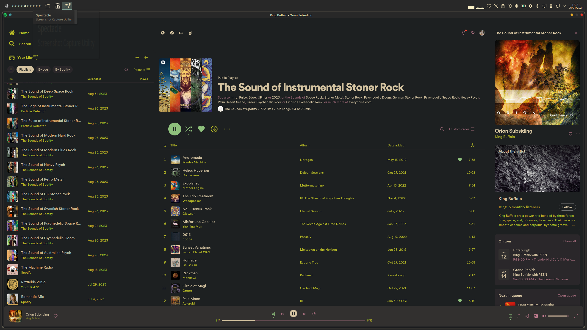
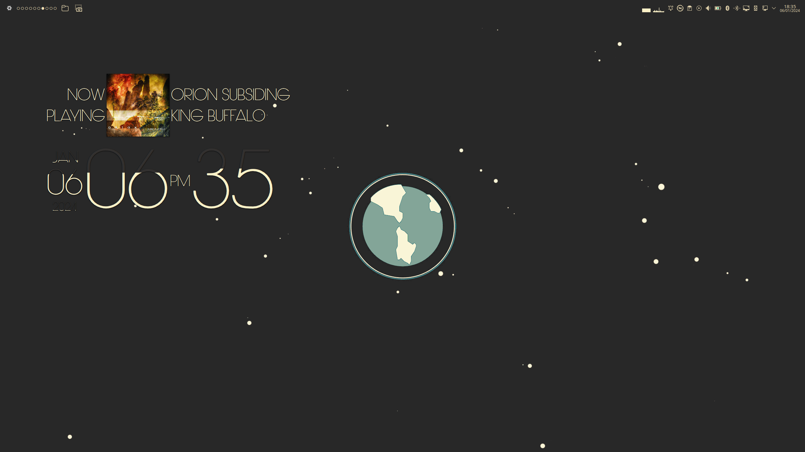
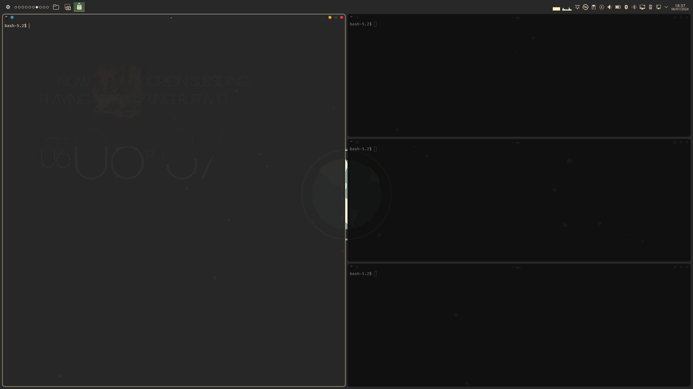

# nixos_config
My private nixos_config
Screensthot:






Step 1:
Install basic git


Step 2: Install git

```shell
nix-env -iA nixos.git
```

Step 3: Clone my repository

```shell
git clone git@github.com:olafkfreund/nixos_config.git
```

Step 4: Unzip the downloaded file

  ```shell
  cd nixos_config
  ```

Step 5:
Copy the contents of the cloned "nixos" folder to /etc/nixos or your nixos dir ( ~/.config/nixos ) 
Note: This will exclude the hidden .git folder

```shell
sudo rsync -av --exclude='.git' ./* ~/.config/nixos
```

Step 6:

```shell
sudo chown -R $(whoami):$(id -gn) ~/.config/nixos
```

