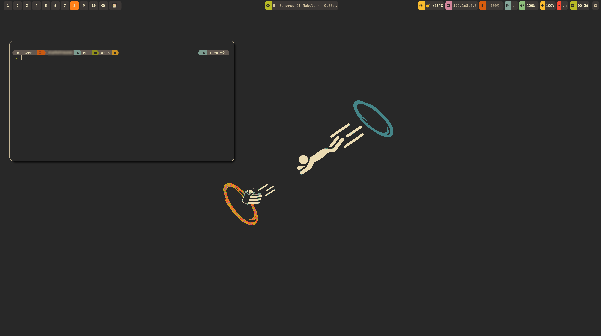

# Nixos configuration

My private Nixos configuration

Screenshot:





Step 1: Install git

```shell
nix-env -iA nixos.git
```

Step 3: Clone my repository

```shell
git clone git@github.com:olafkfreund/nixos_config.git
```

Step 4: Enter the cloned directory

```shell
cd nixos_config
```

Step 5:
Copy the contents of the cloned "nixos" folder
to /etc/nixos or your nixos dir this is mine: ~/.config/nixos

Note: This will exclude the hidden .git folder

```shell
sudo rsync -av --exclude='.git' ./* ~/.config/nixos
```

Step 6:

```shell
sudo chown -R $(whoami):$(id -gn) ~/.config/nixos
```
