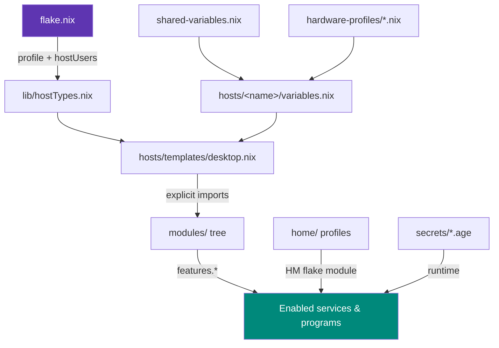

# Architecture

This section explains *how* the configuration is built and, more importantly,
*why* each choice was made. Every page leads with the problem it solves.

- :material-thought-bubble: __[Philosophy & Why](philosophy.md)__

    ---

    The guiding principles: explicitness, thin hosts, trusting the module
    system, security by default.

- :material-file-tree: __[Host Template System](template-system.md)__

    ---

    One parameterised template builds every host. How `profile` selects
    workstation vs laptop behaviour.

- :material-flag: __[Feature Flags](feature-flags.md)__

    ---

    Typed feature toggles with dependency and conflict validation — the dials
    that shape each host.

- :material-expansion-card: __[Hardware Profiles](hardware-profiles.md)__

    ---

    AMD / NVIDIA / Intel GPU stacks abstracted into reusable profiles.

- :material-layers-triple: __[Overlays](overlays.md)__

    ---

    How custom packages and upstream fixes are layered onto nixpkgs.

- :material-palette: __[Theming (Stylix)](theming.md)__

    ---

    A single base16 palette driving colours across the whole desktop stack.

- :material-key-variant: __[Secrets (agenix)](secrets.md)__

    ---

    Age-encrypted secrets committed to git and loaded at runtime, never at
    evaluation.

- :material-home-account: __[Home Manager](home-manager.md)__

    ---

    User environments as a flake module — activated by the system rebuild.

## The data flow

